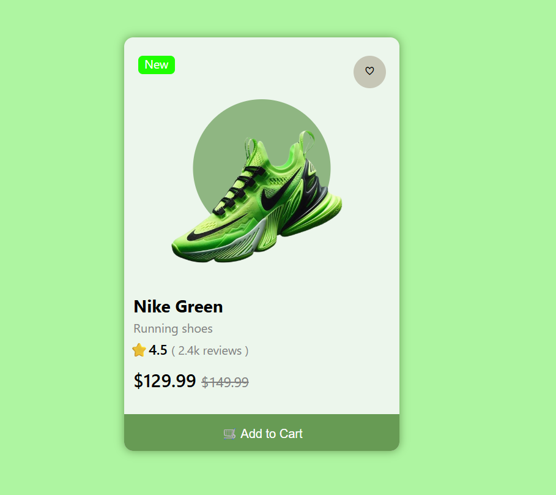

# Day 02 — Product Card 👟

## 🎯 Challenge

Recreated a modern e-commerce product card from a reference UI using HTML and CSS.

The goal was to build the UI from scratch without following a tutorial or copying the original code.

## 🛠️ Technologies

- HTML5
- CSS3
- Flexbox
- CSS Positioning
- Font Awesome / Icons

## 📚 Concepts Practiced

- HTML structure
- Images
- Headings
- Paragraphs
- Buttons
- Semantic elements
- Box Model
- Margin
- Padding
- Width and Height
- Border Radius
- Colors
- Typography
- Flexbox
- `position: relative`
- `position: absolute`
- `z-index`
- `transform`
- `opacity`
- CSS transitions
- `:hover`
- Product image positioning

## ✨ Features

- New product badge
- Wishlist button
- Product image
- Background circle behind product image
- Product name
- Product category
- Star rating
- Review count
- Current price
- Original price
- Add to Cart button
- Hover interactions
- Responsive centered layout

## 📸 UI

## ⏱️ Time

60–90 minutes

## 🧠 What I Learned

- How to structure an e-commerce product card
- How to center a card using Flexbox
- How to position elements using relative and absolute positioning
- How to place one element behind another using `z-index`
- How to create a circular background behind a product image
- How to create hover effects
- How to use transitions and transforms
- How to create a clear product price hierarchy
- How to organize CSS for a small UI component

## 🚀 Status

Completed ✅

## 📈 Day 2 Progress

I built this UI independently from a reference image and practiced making layout and styling decisions without using a tutorial.