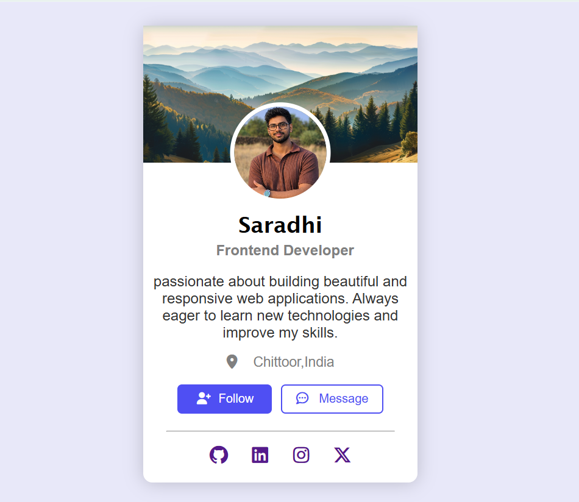

# Day 01 — Profile Card

## 🎯 Challenge

Recreated a profile card UI from a reference image using HTML and CSS.

## 🛠️ Technologies

- HTML5
- CSS3
- Flexbox
- CSS Positioning
- Font Awesome

## 📚 Concepts Practiced

- HTML structure
- Images
- Headings
- Paragraphs
- Buttons
- Links
- Box Model
- Margin
- Padding
- Border
- Border Radius
- Box Shadow
- Flexbox
- Absolute Positioning
- Transform
- Hover Effects
- Typography

## ✨ Features

- Profile background image
- Circular profile image
- Profile information
- Location
- Follow button
- Message button
- Social media icons
- Hover effects

## 📸 Reference UI

## 📸 My Result

## ⏱️ Time

60–90 minutes

## 🧠 What I Learned

- How to create a profile card using HTML and CSS
- How to center elements using Flexbox
- How to create a circular profile image
- How to overlap elements using absolute positioning
- How to use `transform: translateX()`
- How to create button hover effects
- How to use spacing and shadows to improve UI

## 🚀 Status

Completed ✅